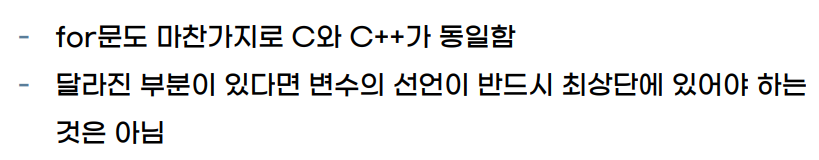

# 교수님의 강의자료에 있던 오류 정정해두기



우린 이게 아니라는걸 압니다. 그래서 준비했습니다!

[code](./vars.c)

```c
#include <stdio.h>

int main(void)
{
    // 교수님의 강의자료에서, C++은 "C와 달리" 
    int a = 8;
    printf("a = %d\n", a);
    int b = 42;     // c에서도 변수는 최상단이 아니어도 됨.
    printf("b = %d\n", b);
    return 0;
}
```
